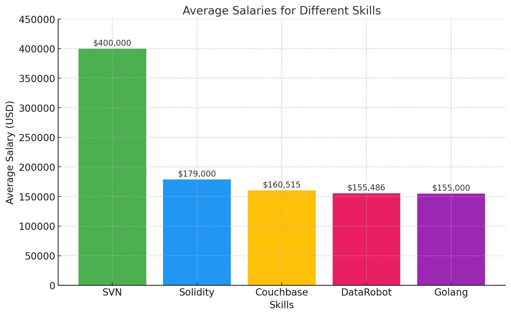

# Introduction
Welcome to my project, where I dive into data 📊 to uncover trends in the job market for data analysts! This project leverages real-world datasets 🗄️ to analyze salaries 💰, skills 🛠️, and industry demands across sectors like tech 🌐, finance 💹, and more.
Core tools like SQL 🗄️, Python 🐍, and visualization platforms such as Tableau 📈 or Power BI 📊 are in focus, along with emerging technologies driving the next wave of opportunities 🌟. Let’s uncover insights that illuminate the career path of a data analyst!

SQL queries? Check them out here: [project_sql folder](/project_sql/)

# Background
The demand for data analysts has skyrocketed as companies across industries rely on data to make smarter decisions and stay ahead. Data analysts are the ones who take messy data, clean it up, and turn it into insights that businesses can actually use. It’s a role that’s become a huge deal in today’s world, and I’ve always been fascinated by the impact it has.
I started this project because I wanted to dig deeper into what it takes to be a data analyst—what skills are in demand, how salaries vary, and which industries are hiring. By analyzing real-world data, I hope to uncover trends and patterns that not only help me understand the job market better but also offer some guidance to others interested in this field.
### The questions I wanted to answer through my project were:

1. What are the top paying Data Analyst job?
2. What skills are required for top paying Data Analyst jobs?
3. What are the most in demand skills for data analysts?
4. What are the top skills based on salaries?
5. What are the most optimal skills to learn(optimal:high demand and high paying)?

The data for this project is taken from [SQL Course](https://lukebarousse.com/sql). It's filled with insights on job market regarding the positions, salaries and many more

# Tools I Used
To analyze the data and build insights about the job market for data analysts, I utilized the following tools:

- **SQL:** SQL was used to query, filter, and manipulate the data. Its ability to efficiently handle structured datasets made it an essential tool for this project, helping to extract meaningful insights from the raw data.

- **PostgreSQL:** PostgreSQL, a powerful open-source relational database system, served as the backbone for storing and managing the dataset. It provided advanced querying capabilities and excellent support for handling large datasets.

- **VS Code:** Visual Studio Code was my primary code editor for writing SQL queries and managing the project. Its extensions and integrated tools made development smoother and more efficient.

- **Git:** Git was used for version control, enabling me to track changes, experiment with different approaches, and maintain a clear history of my work.

- **GitHub:** GitHub served as the platform to host and share my project. It allowed me to collaborate (if needed), showcase my work, and make it easily accessible to others interested in the findings.

# The Analysis
Each query is structured to answer specific aspect of the job market. Here's how I aproached the questions:

### What are the top-paying Data Analyst jobs?
This query explores which specific roles or specializations within the field of data analysis command the highest salaries. By analyzing salary data, the project highlights the most lucrative opportunities for data analysts.
``` sql
SELECT
    job_postings_fact.job_id,
    job_postings_fact.job_title,
    job_postings_fact.job_location,
    job_postings_fact.job_schedule_type,
    job_postings_fact.salary_year_avg,
    job_postings_fact.job_posted_date,
    company_dim.name as company_name
FROM
    job_postings_fact
    LEFT JOIN company_dim on job_postings_fact.company_id = company_dim.company_id
WHERE
    job_title_short = 'Data Analyst' AND
    job_location = 'Anywhere' AND
    salary_year_avg is not null
ORDER BY
    salary_year_avg DESC
LIMIT
    10
```

The project analyzed job postings for data analyst positions across various companies. Key findings include:

- **Salary Range:** Salaries for full-time data analyst roles range from $184,000 to $650,000 annually.
- **Job Levels:** Positions vary from entry-level analysts to director-level roles.
- **Work Flexibility:** Most jobs offer "Anywhere" location with some hybrid or remote options.
- **Recent Postings:** Listings were posted throughout 2023, with the latest in December.
These trends highlight a broad range of opportunities within the data analysis field, catering to different experience levels and offering flexible work arrangements.


*Bar graph to visualize the top paying jobs for data analysts; Chatgpt generated this graph from my SQL query result*

### What skills are required for top paying Data Analyst jobs?
This query explores the in-demand skills associated with the highest-paying data analyst roles, highlighting trends, industry preferences, and their impact on earning potential.

``` sql
WITH top_paying_jobs as(
    SELECT
        job_postings_fact.job_id,
        job_postings_fact.job_title,
        job_postings_fact.salary_year_avg,
        company_dim.name as company_name
    FROM
        job_postings_fact
        LEFT JOIN company_dim on job_postings_fact.company_id = company_dim.company_id
    WHERE
        job_title_short = 'Data Analyst' AND
        job_location = 'Anywhere' AND
        salary_year_avg is not null
    ORDER BY
        salary_year_avg DESC
    LIMIT 10
)

SELECT 
    top_paying_jobs.*,
    skills_dim.skills
FROM
    top_paying_jobs
    INNER JOIN skills_job_dim on top_paying_jobs.job_id = skills_job_dim.job_id
    INNER JOIN skills_dim on skills_job_dim.skill_id = skills_dim.skill_id
ORDER BY
    salary_year_avg DESC
```
The dataset reveals common skills sought by employers for data analyst roles across various companies. Key insights include:

- **Skills in High Demand:** The most frequently requested skills include SQL, Python, and Tableau. Other skills that appear frequently are Excel, R, and various cloud platforms (e.g., AWS, Azure).
- **Specialized Tools:** Specific tools and technologies such as Pandas, GitLab, Snowflake, and Power BI are also commonly listed across the positions.
- **Diversity of Roles:** These positions span a variety of levels, from associate to principal and director roles, highlighting the diverse range of expertise required in data analysis.
In summary, employers prioritize technical skills in programming (Python, SQL), data visualization (Tableau), and cloud technologies, with many roles requiring familiarity with data processing libraries and tools.


*Bar graph it visualize the skills required for the top paying jobs; Chatgpt generated this graph from my SQL query result*

### What are the most in demand skills for data analysts?
This query explores the top 5 most in demand skills for data analysts regardless of the pay for those skills.

``` sql
SELECT 
    skills,
    count(skills_job_dim.job_id) as demand_count
FROM
    job_postings_fact
    INNER JOIN skills_job_dim on job_postings_fact.job_id = skills_job_dim.job_id
    INNER JOIN skills_dim on skills_job_dim.skill_id = skills_dim.skill_id
WHERE
    job_title_short = 'Data Analyst' and 
    job_work_from_home = TRUE
GROUP BY
    skills
ORDER BY
    demand_count DESC
LIMIT 5
```

This dataset reveals the most in-demand skills for data analyst roles, with SQL leading significantly, followed by Excel, Python, Tableau, and Power BI, indicating a strong emphasis on database management, programming, and data visualization tools in the industry.
- **SQL Dominance:** SQL is the most sought-after skill, emphasizing the importance of database querying and management in data analysis roles.
- **Excel's Continued Relevance:** Despite the rise of advanced tools, Excel remains a critical skill, showcasing its versatility for data manipulation and reporting.
- **Programming Skills:** Python ranks high, reflecting the growing demand for programming expertise for data processing, automation, and advanced analytics.
- **Data Visualization Tools:** Tableau and Power BI are prominently featured, highlighting the importance of visual storytelling and presenting data insights effectively.
- **Balanced Skillset:** The mix of skills indicates that top data analysts are expected to combine technical, analytical, and visualization proficiencies for comprehensive data solutions.
These points underline the diverse skill set required for excelling in data analysis careers.


*Top skills for data analysts; Chatgpt generated this graph from my SQL query result*

### What are the top skills based on salaries?
This query explores the top skills based on the salaries that each skills can offer you regardless of their popularity.

``` sql
SELECT 
    skills,
    round(avg(salary_year_avg)) as skill_avg_salary
FROM
    job_postings_fact
    INNER JOIN skills_job_dim on job_postings_fact.job_id = skills_job_dim.job_id
    INNER JOIN skills_dim on skills_job_dim.skill_id = skills_dim.skill_id
WHERE
    job_title_short = 'Data Analyst' and 
    salary_year_avg is not null
GROUP BY
    skills
ORDER BY
    skill_avg_salary DESC
LIMIT 5
```
- **Top-Paying Skills:** The query identifies the most lucrative skills for Data Analysts, helping professionals prioritize which skills to learn or improve for higher salary prospects.
- **Technical Proficiency Drives Earnings:** High-paying skills likely include advanced tools and technologies like Python, SQL, and Tableau, indicating the importance of technical expertise.
- **Skill Specialization is Rewarded:** The results might show that specialized skills (e.g., machine learning frameworks or cloud platforms) command higher salaries than generalist tools.
- **Salary Trends:** The average salaries reveal current market trends, helping candidates align their skillsets with in-demand and well-compensated competencies.
- **Actionable Guidance:** Professionals can use this data to focus their learning and development efforts on skills that provide the best return on investment.
- **Employer Preferences:** Companies' demand for specific skills reflects industry needs, helping educational programs and training initiatives target relevant areas.


*visualization for top skills based on salary; Chatgpt generated this graph from my SQL query result*

### What are the most optimal skills to learn(optimal:high demand and high paying)?
This query explore which skills to learn at the beginning that will provide you with more job opportunities.

``` sql
WITH skill_demand as (
    SELECT 
        skills_dim.skill_id,
        skills_dim.skills,
        count(skills_job_dim.job_id) as demand_count
    FROM
        job_postings_fact
        INNER JOIN skills_job_dim on job_postings_fact.job_id = skills_job_dim.job_id
        INNER JOIN skills_dim on skills_job_dim.skill_id = skills_dim.skill_id
    WHERE
        job_title_short = 'Data Analyst' and 
        job_work_from_home = TRUE AND
        salary_year_avg is not null
    GROUP BY
        skills_dim.skill_id

), average_salary as (
    SELECT 
        skills_job_dim.skill_id,
        round(avg(salary_year_avg)) as skill_avg_salary
    FROM
        job_postings_fact
        INNER JOIN skills_job_dim on job_postings_fact.job_id = skills_job_dim.job_id
        INNER JOIN skills_dim on skills_job_dim.skill_id = skills_dim.skill_id
    WHERE
        job_title_short = 'Data Analyst' and 
        salary_year_avg is not null and 
        job_work_from_home = TRUE
    GROUP BY
        skills_job_dim.skill_id 
)

select
    skill_demand.skill_id,
    skill_demand.skills,
    demand_count,
    skill_avg_salary
from
    skill_demand
    inner join average_salary on skill_demand.skill_id = average_salary.skill_id
WHERE
    demand_count>10
ORDER BY
    skill_avg_salary DESC,
    demand_count DESC 
LIMIT
    25
```
This query merges the two query from before to make a better code that will display the most optimal skills for data analyst. Here are the findings:
- **High Demand:** Python and Tableau are in high demand but offer moderate salaries.
- **High Salary:** Go offers the highest salary with lower demand.
- **Balanced Skills:** Python, R, and AWS balance high demand with decent salaries.
- **Specialized Roles:** Niche skills like Go and Hadoop offer higher salaries but lower demand.
- **Emerging Technologies:** Cloud and data tools like AWS and Snowflake are growing in demand and salary.

.png)
*Chatgpt generated this graph from my SQL query result*

.png)
*Chatgpt generated this graph from my SQL query result*
1. **Demand Count by Skill**: A bar chart showing the number of job postings or demand for each skill, with the most in-demand skills appearing on the left.
2. **Average Salary by Skill:** A bar chart showing the average salary for each skill, with the highest-paying skills on the left.


# What I Learned

I have learned a lot from this project. I have packed my SQL knowledge with some serious techniques like:
- **Complex Query Crafting:** Building advanced SQL queries taught me how to join multiple tables, use subqueries, and implement CTEs (Common Table Expressions) effectively. This improved my ability to handle large datasets and answer multifaceted questions.
- **Data Aggregation Techniques:** I gained expertise in using SQL functions like GROUP BY, AVG, and COUNT to aggregate data, uncover trends, and summarize key insights, which are fundamental for high-level analysis.
- **Analytical Thinking:** Breaking down complex problems into smaller, manageable parts helped me develop a systematic approach to identify patterns, correlations, and actionable insights in the data.
- **Decision-Making with Data:** Analyzing salary and skill trends for data analysts emphasized the importance of using data-driven insights to inform career and business strategies, enhancing my decision-making capabilities.
  
# Conclusions
This project highlighted key trends in the data analyst job market, including top-paying skills, in-demand tools, and optimal learning paths. It reinforced the importance of technical expertise, data storytelling, and problem-solving.
Being a data analyst means transforming raw data into actionable insights that drive decisions. This project deepened my understanding of the field's dynamic nature and the balance of technical and strategic skills needed to succeed.

